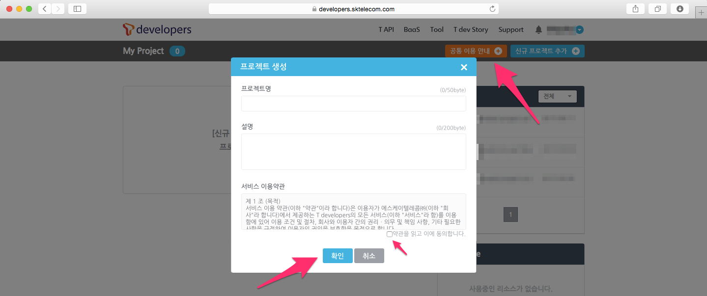
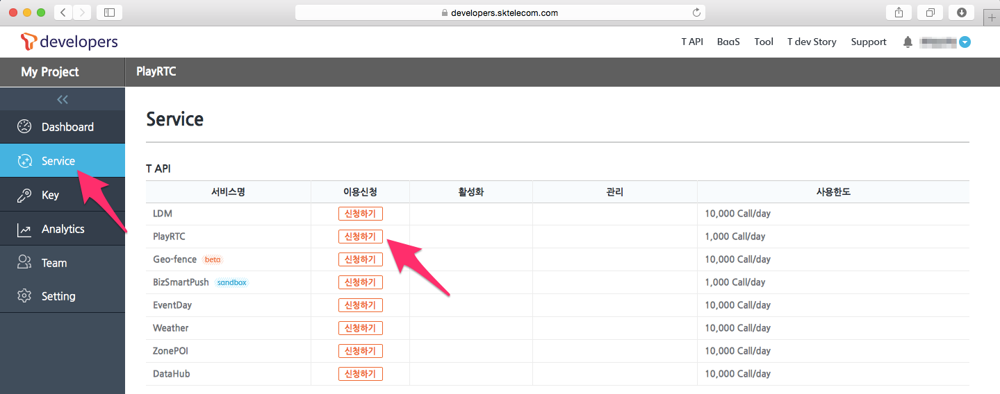
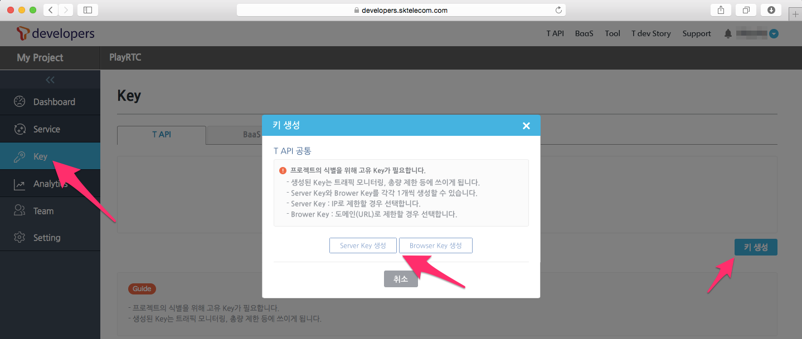
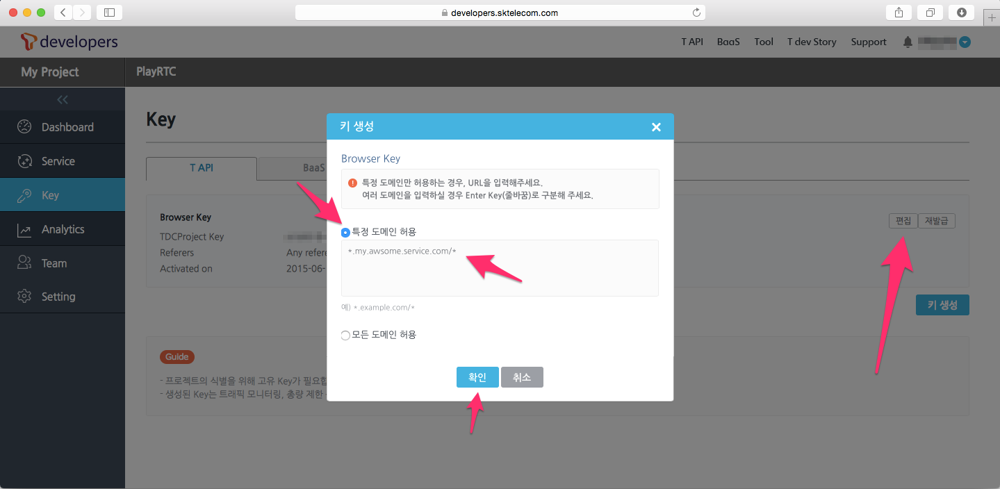

# Project Key

PlayRTC 서비스를 사용하려면 T Developers에 가입하고 프로젝트를 생성하여 프로젝트 키를 받아야 합니다.

- 한국어 사용자는 아래의 안내에 따라 T Developers에 가입하여 프로젝트 키를 발급받으면 됩니다.
- 다국어 사용자는 playrtc@sk.com으로 연락 주세요.

## Sandbox Key

첫 사용시 간단한 테스트를 위해서 아래의 공개된 Sandbox 키를 제공합니다.  

- 60ba608a-e228-4530-8711-fa38004719c1

하지만 이 키는 보안과 서비스 환경을 보장하지 않으며 경우에 따라 작동을 안할 수 있으니 간단 테스트 용도이외에는 아래의 절차에 따라 직접 사용할 키를 발급받으셔야 합니다.

## T Developers

T Developers(https://developers.sktelecom.com)는 SK Telecom의 다양한 API를 통합 지원하는 개발자를 위한 공간으로, PlayRTC를 포함한 많은 서비스의 운영과 사용 계약 관련 정보 등을 제공하며 또한 관리하고 있으며 아래의 기능을 제공 합니다.

- PlayRTC 서비스 인증을 위한 Project Key 발급
- PlayRTC 서비스 사용, 차단 등 API 제어
- PlayRTC 서비스 운영 시 발생하는 API 트래픽 모니터링 및 로그, 통계 확인
- PlayRTC 기반의 서비스를 운영 중에 발생하는 각종 모니터링 및 로그, 통계 관련 기능
- PlayRTC 서비스 사용 계약과 관련된 문의 사항 및 계약 사항 처리

T Developers에 대한 자세한 소개 및 추가적으로 제공 받을 수 있는 SK Telecom 서비스 등은 [T Developers 서비스가이드](https://developers.sktelecom.com/community/faq/)에서 확인하고 이곳에서는 간단하게 회원 가입, Project Key 획득 및 활성화 방법 만 살펴보도록 하겠습니다.

## T Developers 회원 가입

SK Telecom 개발자 포털인 T Developers에 접속, [개발자 회원 가입](https://developers.sktelecom.com/member/memberAgree/)을 선택하고 절차에 따라 회원 가입을 합니다.

이 때 일반적인 경우는 `일반 사용자`를 선택하면 됩니다. 법인 사업자는 대규모 사용과 계정관리를 필요로 하는 사업자를 위한 가입 절차이며 이 방식의 가입을 원하면 T Developers의 안내에 따르면 됩니다.

간단한 메일 인증을 통해 가입이 완료 됩니다.

## 프로젝트 추가하기

회원 가입 완료 후 Login 합니다.

My Project > 신규 프로젝트 추가를 선택하고, 프로젝트 이름과 설명을 작성합니다. 프로젝트 이름은 Application명 으로 사용하면, 구분과 이해가 쉽습니다.

## PlayRTC 사용 신청

이제 등록한 프로젝트가 My Project에 나타납니다. 목록에서 방금 생성한 프로젝트 이름을 선택하고 왼쪽의 `Service`탭을 선택하고 `PlayRTC`를 신청합니다.

이로써 사용신청이 완료되었습니다.

## PlayRTC 프로젝트 키 발급받기

`Key`탭을 선택하고 `키생성`을 선택합니다.

이 때, `Server Key`와 `Browser Key`를 만들 수 있습니다. 서버키는 IP로 접속 제한을 걸때 사용하며, 브라우저키는 URL 주소로 접속 제한을 걸때 사용하면 됩니다. 접속 제한을 이 필요 없으면 둘 중 하나를 선택한 후 `모든 IP 허용`혹은 `모든 도메인 허용`을 선택하면 됩니다. 단 이 설정은 브라우저 SDK를 사용할 시 HTML 페이지에 표시되어 쉽게 외부로 노출되니 아래의 접속 제한하기를 꼭 설정하여야 합니다.

이제 키가 생성되는데 `60ba608a-e228-4530-8711-fa38004719c1`와 같은 UUID 형태로 이 키를 PlayRTC Javascript/Android/iOS SDK에 삽입하여 사용하면 됩니다.

## 프로젝트 키를 통해 접속 제한 설정하기

내 서비스가 `10.0.0.10`이나 `awsomechat.com`으로 호스팅 되고 있다면, 보안상 다른 IP인 `20.20.20.20`이나 다른 URL인 `phishing.your.service.com`의 API 호출을 제한할 필요가 있습니다. 이 때 IP 허용은 `Server Key`로, URL 허용은 `Browser Key`로 허용하고 싶은 IP나 URL을 입력하면 됩니다. 특히 브라우저 SDK를 사용할 시 HTML 페이지에 키가 표시되어 쉽게 외부로 노출되니 필수적으로 설정을 하여야 합니다.

## PlayRTC 활성화 하기

다시한번 `Service`탭을 보면 이용신청은 완료가 되어 있으며, 활성화 스위치는 `off`상태 입니다. 이를 `on`으로 변경하면 사용이 가능 합니다.

이제 신청자의 격리된 환경에서 PlayRTC의 모든 사용 준비가 끝났습니다.

## T Developers 기타 기능

T Developers에서는 프로젝트 키 관리 이외에도 사용량 관리, 로그등 다양한 기능을 제공하고 있습니다.

자세한 T Developers 회원 가입 및 프로젝트 생성 그리고 추가적으로 제공 받을 수 있는 SK Telecom 서비스 등은 [T Developers 서비스가이드](https://developers.sktelecom.com/community/faq/)에서 확인이 가능합니다.
